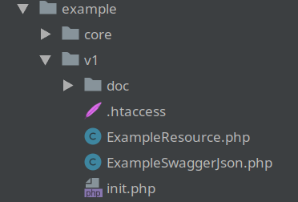

PHP-API-REST
============
PHP API REST framework using annotations, and Swagger 2.0 support.

Prerequisites
=============

* PHP >=7.2

Optional (Recommended)
=====================

### Caching routes

* nrk/predis (Redis) - [https://github.com/nrk/predis](https://github.com/nrk/predis)
Or
* Pecl APC - Alternative PHP Cache - [https://pecl.php.net/package/apc](https://pecl.php.net/package/apc)

### Swagger yaml format

* yaml pecl extension [https://pecl.php.net/package/yaml](https://pecl.php.net/package/yaml)

Installing
==========

Use composer to manage your dependencies and download PHP-API-REST:

```bash
composer require diomac/php-api-rest
```

Get Started
===========

###API Rest Configuration

* 1 - Place an .htaccess file in the root folder of your Rest API (base url), to redirect all routes to the API initialization file.

Example API folders:



.htaccess file:

```
RewriteEngine On
RewriteCond %{REQUEST_URI} !init\.php$
RewriteCond %{REQUEST_FILENAME} !-f
RewriteRule .* init.php [L,QSA]
```

* 2 - Use the initialization file to import the dependencies of your project and...
    * Instantiate a Diomac\API\AppConfiguration object;
    * Set the base url of your API;
    * Add the Resources Class Names of your API 
    (See [Implementing API Rest Resources](https://github.com/diomac/php-api-rest#implementing-api-rest-resources));
    * Instantiate a Diomac\API\App object using the configuration object;
    * Finally call exec method.
    
init.php file:

```
use Diomac\API\App;
use Diomac\API\AppConfiguration;

/**
 * Initializing API configuration
 */
$config = new AppConfiguration();
$config->setBaseUrl('/php-api-rest/vendor/example/v1');

/**
 * Adding resources classes
 */
$config->addResource(\example\v1\ExampleResource::class);
$config->addResource(\example\core\secure\ExampleGuard::class);

/**
 * Execute API
 */
try{
    $app = new App($config);
    $app->exec();
}catch (Exception $ex){
 ...
}
```

###Implementing API Rest Resources

* 3 - In the resource class, enter the inheritance of the Resource class:

```
namespace example;

use Diomac\API\Resource;
use Diomac\API\Response;
use Diomac\API\UnauthorizedException;

class ExampleResource extends Resource 
{
    ...
}
```

* 4 - For each method of the resource class, 
enter PHP annotation to identify routes (@route), 
HTTP methods (@method) and if you need a 
Class implementing Guard Interface to protect 
the route (@guard - See how implement guards 
in topic 
[Implementing a Guard Class](https://github.com/diomac/php-api-rest#implementing-a-guard-class) ):
```
/**
* @method get
* @route /auth/usr-data/id/{id}
* @guard(
*     className="example\core\secure\ExampleGuard",
*     @parameters(operationId="GETUSERDATA")
* )
*/
function getUsrData()
{
  // ... your code
  $this->response->setCode(Response::OK); // set HTTP response code
  $this->response->setBodyJSON($ this->request->getData()); // set responde data
  return $this->response; // return response object
}
```
## Running a route

Whenever a route is executed, the class holding the route will be instantiated and inherit the following attributes:

A Request object with the methods:
```
$this->request->getParams() // returns the parameters of the URL and $_GET
$this->request->getData()   // returns an object sent by the front end
$this->request->getRoute()  // returns the executed route
$this->request->getMethod() // returns the executed HTTP method
```
A Response object with the methods:
```
$this->response->setHeader('name', 'value'); // set HTTP header response
$this->response->setCode(Response::BAD_REQUEST); // set HTTP response code
$this->response->setBody('string'); // set response body
$this->response->setBodyJSON(\JsonSerializable object); // set response body to convert in JSON
$this->response->setContentType(''); // set content type response (for setBodyJSON not needed)
```
And it inherits methods from the Resource class:
```
$this->getRoute(); // returns the configured route
$this->getParams(); // returns the parameters of the URL and $_GET
$this->getParam('name'); // returns a parameter by name
```
For the output simply return the response object:
```
return $this->response;
```
## Using one or more route guards
```
/**
* @method get
* @route /auth/usr-data/id/{id}
* @guard(
*     className="example\core\secure\ExampleGuard"
* )
* @guard(
*     className="example\core\secure\ExampleGuardWithParams",
*     @parameters(operationId="GETUSERDATA", operationName="GETUSERDATA")
* )
*/
function getUsrData()
{
  // ... your code
  $this->response->setCode(Response::OK); // set HTTP response code
  $this->response->setBodyJSON($ this->request->getData()); // set responde data
  return $this->response; // return response object
}
```
## Implementing a Guard Class
```
namespace api\secure;

use Diomac\API\Exception;
use Diomac\API\ForbiddenException;
use Diomac\API\UnauthorizedException;
use Diomac\API\Response;
use Diomac\API\Guard;

/**
 * Class AuthGuard
 * @package api\secure
 */
class AuthGuard implements Guard
{
    /**
     * @param object|null $guardParams
     * @return bool
     * @throws Exception
     * @throws ForbiddenException
     * @throws UnauthorizedException
     */
    public function guard(object $guardParams = null) : bool
    {
        $func = $guardParams->func;
        $access = checkAccess($func);
        switch ($access) {
            case Response::OK:
                return true;
                break;
            case Response::UNAUTHORIZED:                
                throw new UnauthorizedException();
                break;
            case Response::FORBIDDEN:                
                throw new ForbiddenException();
                break;
            default:               
                throw new Exception('Server Error!', Response::INTERNAL_SERVER_ERROR);
        }
    }
}
```
## Using route cache with Redis
```
```

## Using route cache with APC - Alternative PHP Cache
```
**
 * Setting use cache for caching of annotations mapping
 */
$config->setUseCache(true);

/**
 * Execute API
 */
try{
    $app = new App($config);
    $app->exec();
}catch (Exception $ex){
    ...
}
```
## Swagger 2.0 support

### swagger.json or swagger.yaml
Create a route in a resource like the example below:

PHP Class:

```
use Diomac\API\Resource;
use Diomac\API\Response;
use example\v1\doc\ExampleSwaggerDoc;

class ExampleSwaggerJson extends Resource
{
    /**
     * @method get
     * @route /swagger.json
     */
    function swaggerJson()
    {
        $this->response->setCode(Response::OK);
        $swagger = new ExampleSwaggerDoc();

        /**
         * JSON
         */
        $this->response->setBodySwaggerJSON($swagger);
        /**
         * Or YAML
         */
        //$this->response->setBodySwaggerYAML($swagger);
        return $this->response;
    }
}
```

Route result:

```
{
  "swagger": "2.0",
  "info": {
    "version": "1.0.0",
    "title": "Swagger Sample App",
    "description": "This is a sample server Petstore server.",
    "termsOfService": "http:\/\/swagger.io\/terms\/",
    "contact": {
      "name": "API Support",
      "email": "support@swagger.io",
      "url": "http:\/\/swagger.io"
    },
    "license": {
      "name": "Apache 2.0",
      "url": "http:\/\/www.apache.org\/licenses\/LICENSE-2.0.html"
    }
  },
  "host": "localhost",
  "basePath": "\/php-api-rest\/vendor\/example\/v1",
  "schemes": [
    "http",
    "https"
  ],
  "consumes": [
    "text\/plain; charset=utf-8"
  ],
  "produces": [
    "application\/json",
    "text\/html"
  ],
  "tags": [
    {
      "name": "ExampleAPIDocSwagger",
      "description": "ExampleAPIDocSwagger",
      "externalDocs": {
        "description": "Externaldocsexample",
        "url": "http:\/\/example_php_api_rest.com"
      }
    }
  ],
  "paths": {
    ...
```
### Swagger Info

To document the information (Swagger Info) of your API, you can use Swagger and SwaggerInfo classes. Just implement 
an "ExampleSwaggerDoc" class that inherits from Swagger as in the example below:

PHP Class:
```
use Diomac\API\swagger\Swagger;
use Diomac\API\swagger\SwaggerInfo;

class ExampleSwaggerDoc extends Swagger
{
    public function info(): SwaggerInfo
    {
        $this->setInfo(new SwaggerInfo());
        $this->info->setVersion('1.0.0');
        $this->info->setTitle('Swagger Sample App');
        $this->info->setDescription('This is a sample server Petstore server.');
        $this->info->setTermsOfService('http://swagger.io/terms/');

        $this->info->getContact()->setName('API Support');
        $this->info->getContact()->setEmail('support@swagger.io');
        $this->info->getContact()->setUrl('http://swagger.io');

        $this->info->getLicense()->setName('Apache 2.0');
        $this->info->getLicense()->setUrl('http://www.apache.org/licenses/LICENSE-2.0.html');

        return $this->getInfo();
    }
    ...
}
```

### @tag
#### Use @tag in PHPDoc Class to document Resources's routes with [Swagger Tag Object](https://github.com/OAI/OpenAPI-Specification/blob/master/versions/2.0.md#tagObject).

PHPDoc:
```
/**
 * Class ExampleResource
 * @package example\v1
 * @tag(
 *     name="Example API Doc Swagger",
 *     description="Example API Doc Swagger",
 *     @externalDocs(description="External docs example", url="http://example_php_api_rest.com")
 * )
 */
class ExampleResource extends Resource
{
    ...
}
```

Swagger json result:
```
...
"tags": [
    {
      "name": "ExampleAPIDocSwagger",
      "description": "ExampleAPIDocSwagger",
      "externalDocs": {
        "description": "Externaldocsexample",
        "url": "http:\/\/example_php_api_rest.com"
      }
    }
  ],
...
```
### @tag (string)
#### Use @tag in PHPDoc function to document your route with a additional tag.

PHPDoc:
```
    /**
     * @method get
     * @route /example/api/value1/{value1}/value2/{value2}
     * @tag More one tag
     */
    function getUsrData(): Response
    {
        ...
    }
```

Swagger json result:
```
...
"tags": [
          "More one tag",
          "ExampleAPIDocSwagger"
        ],
...
```
### @contentType
#### Use @contentType in PHPDoc function to document your route with [Swagger produces \[string\]](https://github.com/OAI/OpenAPI-Specification/blob/master/versions/2.0.md#operationObject).
PHPDoc:
```
    /**
     * @method get
     * @route /example/api/value1/{value1}/value2/{value2}
     * @contentType application/json
     * @contentType text/html
     */
    function getUsrData(): Response
    {
        ...
    }
```
Swagger json result:
```
...
"produces": [
    "application\/json",
    "text\/html"
  ],
...
```
### @summary
#### Use @summary in PHPDoc function to document your route with [Swagger summary string](https://github.com/OAI/OpenAPI-Specification/blob/master/versions/2.0.md#operationObject).
PHPDoc:
```
    /**
     * @method get
     * @route /example/api/value1/{value1}/value2/{value2}
     * @summary Example api rest php
     */
    function getUsrData(): Response
    {
        ...
    }
```
Swagger json result:
```
...
"get": {
        "summary": "Example api rest php",
...
```
### @description
#### Use @description in PHPDoc function to document your route with [Swagger description string](https://github.com/OAI/OpenAPI-Specification/blob/master/versions/2.0.md#operationObject).
PHPDoc:
```
    /**
     * @method get
     * @route /example/api/value1/{value1}/value2/{value2}
     * @description A example api rest php
     */
    function getUsrData(): Response
    {
        ...
    }
```
Swagger json result:
```
...
"get": {
        "description": "A example api rest php",
...
```
### @operationId
#### Use @operationId in PHPDoc function to document your route with [Swagger operationId string](https://github.com/OAI/OpenAPI-Specification/blob/master/versions/2.0.md#operationObject).
PHPDoc:
```
    /**
     * @method get
     * @route /example/api/value1/{value1}/value2/{value2}
     * @operationId GETUSERDATA
     */
    function getUsrData(): Response
    {
        ...
    }
```
Swagger json result:
```
...
"get": {
        "operationId": "GETUSERDATA",
...
```
### @consumeType
#### Use @consumeType in PHPDoc function to document your route with [Swagger consumes \[string\]](https://github.com/OAI/OpenAPI-Specification/blob/master/versions/2.0.md#operationObject).
PHPDoc:
```
    /**
     * @method get
     * @route /example/api/value1/{value1}/value2/{value2}
     * @consumeType text/plain; charset=utf-8
     */
    function getUsrData(): Response
    {
        ...
    }
```
Swagger json result:
```
...
"post": {
       "consumes": [
                 "text\/plain; charset=utf-8"
               ],
...
```
### @response(...)
#### Use @response(...) in PHPDoc function to document your route with [Swagger response object](https://github.com/OAI/OpenAPI-Specification/blob/master/versions/2.0.md#responseObject).
PHPDoc:
```
    /**
     * @method get
     * @route /example/api/value1/{value1}/value2/{value2}
     * @response(
     *     code=200,
     *     description="Success",
     *     @schema(
     *     type="object",
     *     @items($ref="#/definitions/sucess")
     * )
     * )
     */ 
    function getUsrData(): Response
    {
        ...
    }
```
Swagger json result:
```
...
"responses": {
          "200": {
            "description": "Success",
            "schema": {
              "type": "object",
              "items": {
                "$ref": "#\/definitions\/sucess"
              }
            }
          },
...
```
## License

This project is licensed under the MIT License - see the [LICENSE](LICENSE) file for details

        
